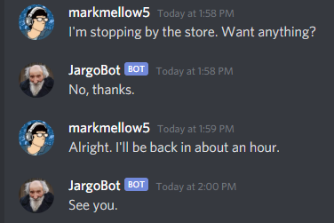
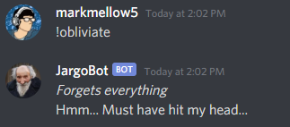

# Discord-GPT-2-AI-Chatbot
An AI chatbot that uses GPT-2 to generate responses to messages on a Discord server.

## Examples
Example Conversation  
  

Example Memory Wipe  

## To Do:
- [ ] Explain how it works in this README
- [ ] Implement separate memory per Discord user
- [ ] Fix infinite <|endoftext|> response 
- [ ] Train model using Google Colab and OpenAI's 1558M model
